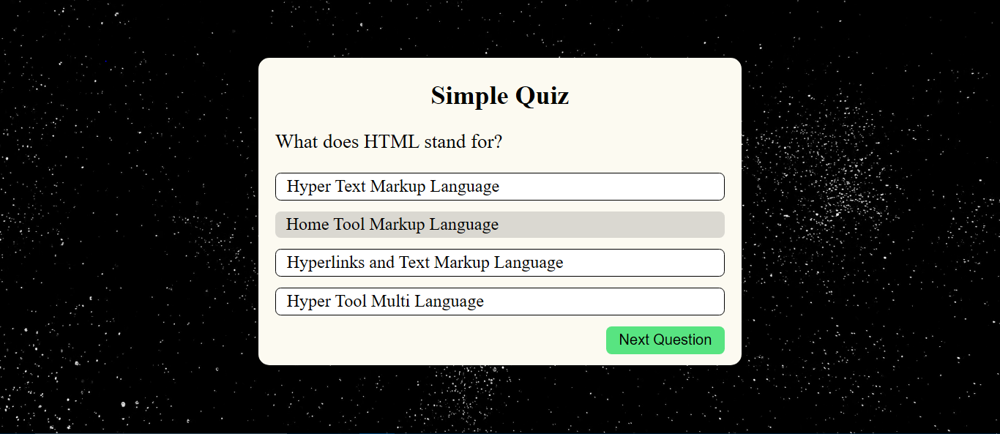

# 🧠 Quiz Application (HTML, CSS, JavaScript)

An interactive **Quiz App** built with vanilla **HTML**, **CSS**, and **JavaScript**, designed to test your knowledge with multiple-choice questions. Includes real-time scoring and a **score history** feature that remembers your previous attempts using browser `localStorage`.

---

## 🌐 Live Demo

🔗 [Play the Quiz Now]( https://mubeen2005.github.io/Quizy---The-Simple-Quiz-Application-/)  

---

## 🖼️ Preview

  

---

## 🧰 Tech Stack

- 🧱 **HTML5** – Structure of the quiz and buttons
- 🎨 **CSS3** – Clean and responsive UI styling
- ⚙️ **JavaScript (Vanilla)** – Quiz logic, score tracking, and localStorage

---

## ✨ Features

- ✅ Multiple-choice questions
- 🔁 One question at a time with auto-navigation
- 🧠 Real-time score calculation
- 🧾 **Score history** stored in localStorage
- 📊 View past quiz attempts
- 🧼 Option to clear history
- 📱 Mobile-responsive design
- 🎯 Instant result display with correct/incorrect highlights

